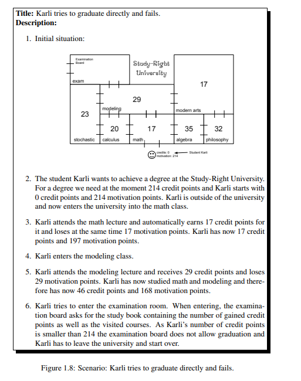

Bill Sendewicz

September 28, 2021

## Lab 4 notes

Link to the group work is [here](lab-challenges/lab04/README.md).

### Main responsibilities

During today's lab, our group had a check-in with Ulno about the status of our user stories and object diagrams from Lab 1 and 2, specifically about the ATM user stories I wrote. The feedback I received was valuable, which specifically instructed me to write my stories like in the book.

Our Lab 1 Mancala examples should be more concrete. Instead of changing it, go back and mention team member's names and say "we assume all situations involve Sarp, Matin, Bill, Sammar." Annotate and  say we will make it better.

Our ATM user stories are too thin. Each user story should be more like in the book: 

The user stories I wrote for the ATM case are more like a use case description.

Should be like: 
"Peter goes to ATM that has 15,000 euros cash inside. Peter inserts his card, selects the withdraw transaction, withdraws 100 euros, enters PIN, the ATM dispenses the notes, now there's 14,900 eur, machine sends transaction to the bank's central database." This example contains too much detail now, but I should mention other cases, such as no money being in the machine, or no money in Peter's account.

I should extend four of my examples to user stories. Spend more energy in initial condition and end condition, and small transactional steps. Then turning these user stories into object diagrams should be easy. ATM user stories should be more concerete. A user story needs to be pitchable; make a movie from it. Mine are too behavior-driven; Ulno wants more story-driven modeling. My user story is more suited in the realm of user-driven modeling.

Ulno likes my object diagrams more than my user stories. He wants more relationships with client and bank, and more objects; more outside relationships. Wants to see more relationships in the system; suggested client, or bank clerk relationships.

Our final project will be building a bank; will want more than this for the ATM case. Intermediate project: Mancala. We can keep these object diagrams here, but need to show some other cases. May also need transaction ledger here, may need to apply command pattern to undo or reverse a transaction. Add some cases that show more interaction with bank and customer.

We will acquire technical debt now because my user stories aren't fleshed out enough, but we can catch up soon.

After our consultation with Ulno, we began work on Lab 4, but we didn't even get the first exercise completed as we didn't understand how to use Fulib.

We will catch up and finish the assignment after today's lab session.

Link to the group work is [here](lab-challenges/lab04/README.md).

I was responsible for Task 2: ATM Money Withdrawal Code Generation, part of Task 4: Code Generation Discussion and Task 8: ATM Money Withdrawal Personas.
