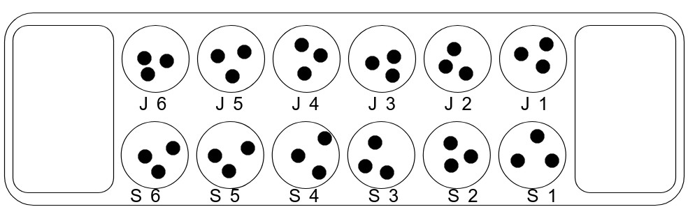
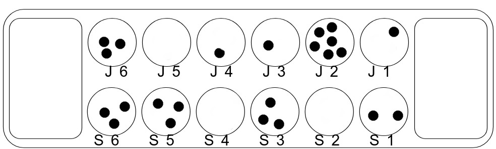
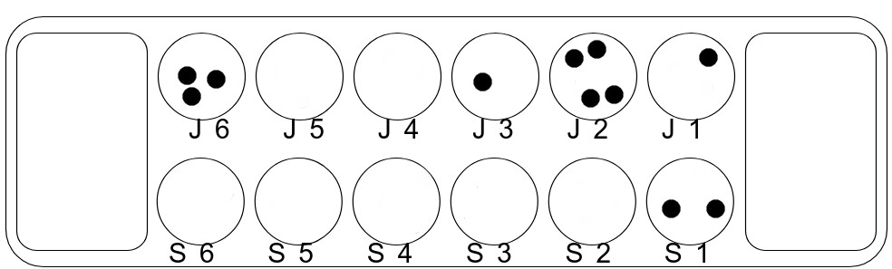
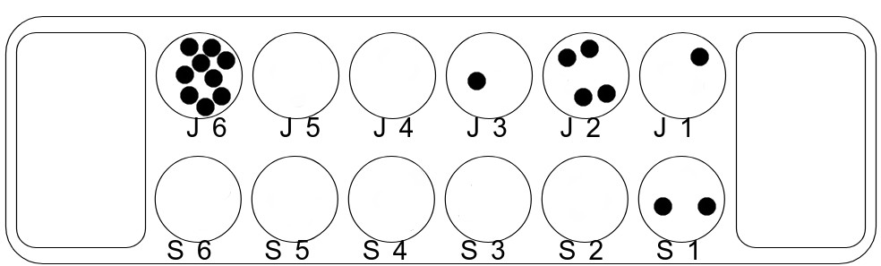
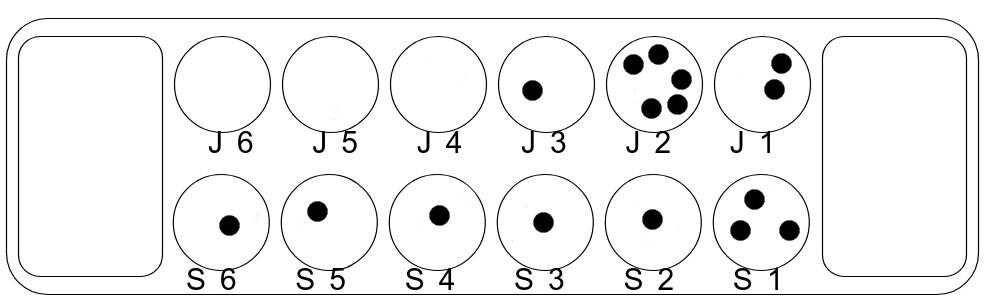
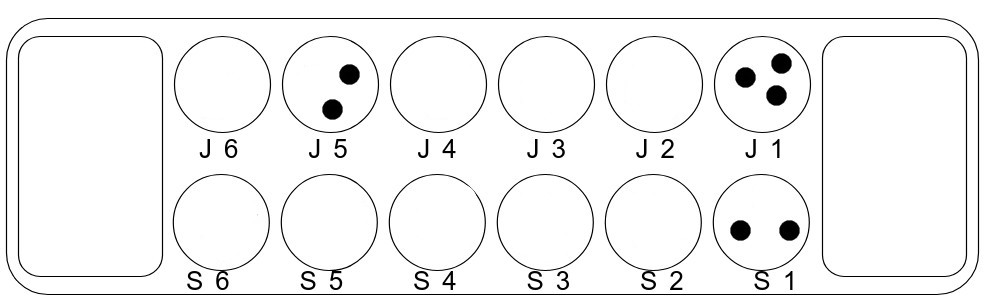

# Lab 1

Exercises from the book called Story Driven Modeling by Ulrich Norbisrath, Ruben Jubeh, Albert Zündorf

## 1.6.1.1 Abstract vs. Concrete
### 1.6.1.1 Terms and Definitions

1\. Discuss in your group the terms “abstract” and “concrete”. Give for each term 10 examples.

Abstract:

1. Organism
2. Table
3. Competition 
4. Drink
5. Ghost
6. Alcohol
7. Building
8. Car
9. Book
10. Sports Player

Concrete:

1. Bill
2. IKEA FREDDE gaming desk
3. London Summer Olympics 2012
4. RedBull
5. Casper
6. Kralovske Zlato lager
7. World Trade Center
8. BMW e36 
9. Catcher In The Rye
10. Lionel Messi

2\. Create a table with the columns abstract and concrete. Find at least 10 sample pairs and add them to the table.

| # | Abstract | Concrete |
| - | - | - |
| 1 | Organism | Bill |
| 2 | Table | IKEA FREDDE gaming desk |
| 3 | Competition | London Summer Olympics 2012 |
| 4 | Drink | RedBull |
| 5 | Ghost | Casper |
| 6 | Alcohol | Kralovske Zlato lager |
| 7 | Building | World Trade Center |
| 8 | Car | BMW e36 |
| 9 | Book | Catcher In The Rye |
| 10 | Sports Player | Lionel Messi |

3\. Have a contest on the most concrete example e.g. for a car.

- Bill: car
- Oleg: blue car
- Matin: blue car with neon lights
- Sammar: blue car with neon lights and a sunroof
- Bill: blue car with neon lights and a sunroof with license plate “123ABC” parked outside Delta on September 7, 2021 at 5:53 PM. Bill wins!

4\. Based on the discussions of the first two exercises, create definitions for “abstract”, “concrete”, and “example”. Examples from the book / lecture are not allowed. Write one paragraph about what these terms could have to do with modeling.
- Abstract - doesn't have a physical representation (i.e., it doesn't have a spatial or temporal location)
- Concrete - is located in time and space\
    Example:\
    Is an instance of a class (i.e., an abstract set)

## 1.6.2.1 Examples for Mau Mau
### 1.6.2.1 Mau Mau

There are plenty of different rules for Mau Mau. Check them out at Wikipedia and add four more to this list.

1. If a player's final card is a Jack, they must call "Mau Mau"
2. Ace skips the next player (Czech Republic)
3. 2 forces the next player to draw two cards (Netherlands)
4. Queen changes suit (Russia)

Give eight examples for Mau Mau situations. They should be reasonably different and target different situations in the game explaining different rules.

1. Bill has one card remaining is his hand, an S10, and plays it on the S9 Matin played before him to win the game
2. Oleg sees a H7 and plays a S7 forcing Sammar to draw two cards
3. Sammar sees a DK but doesn’t have a diamond or a king in his hand and draws a card
4. Matin deals the cards to start the game
5. Oleg sees a C8 and plays a D8 to skip Matin
6. Sammar sees a CQ but doesn’t have a club or a queen, so draws one from the pile. He picks up a HQ but decides not to play it and passes his turn
7. Matin played D8 and that’s why Bill passes a turn to Oleg
8. Oleg sees a HJ and does not have a card to play so he draws a card and it turns out to be DJ so he decides to play it

## 1.6.2.3 Examples for Mancala
### 1.6.2.3 Mancala

While playing write down four examples of different situations.

1. Starting the game by taking all three pebbles from the first house and redistributing one pebble to each of the houses to the right.
2. Taking five pebbles from the house right before the last one on a player's side and putting one pebble in each of the four houses to the right of that house, leaving the final pebble to be placed in that player's store, allowing him to play again.
3. When the last pebble in a player's hand lands in one of his own houses, and if that house had been empty, that player gets to keep all of the pebbles in the opponent's store on the opposite side. The player puts those captured pebbles, as well as the last pebble the player just played, into his store.
4. The game ends when one player puts his last pebble into his store. Then the other player puts the remaining pebbles in his houses into his store, and the winner is the one who has more pebbles in his store than his opponent.

## 1.6.2.6 Examples for ATM
### 1.6.2.6 ATM Money Withdrawal

Consider the software for an automated teller machine (ATM). Take a closer look at the parts being triggered when withdrawing money from an account. Give eight examples of situations in this process.

1. A user authentication method verifies that the PIN the client entered matches the user's PIN on file in the database.
2. A method to ensure that the client doesn’t overdraw his account is called that ensures that withdrawal amount <= balance.
3. A method to ensure that the client doesn’t withdraw a negative amount is called to verify the withdrawal amount > 0.
4. A pop-up message is printed to the screen asking if the client would like to make another transaction.
5. A pop-up message is printed to the screen asking if the client would like a receipt after his transaction is completed.
6. A welcome message pops up after the client’s PIN has been verified asking what operation (deposit, withdrawal, balance inquiry) the client would like to perform.
7. A method compares the amount of money the client entered as a withdrawal amount to the variable containing the amount of cash currently in the ATM.
8. A loop is used to ensure that the client can only proceed to the welcome screen menu if the ATM is currently operating normally (i.e., there is no error); otherwise, the client cannot begin a session and the ATM will return the user's card if it is inserted.

## 1.6.3.3 User stories for Mancala
### 1.6.3.3 Mancala

Extend the four examples from Section 1.6.2.3 to scenarios.

1. Oleg starts the game by taking all three pebbles from his first house and redistributes one pebble to each of his houses to the right.
2. Matin takes five pebbles from his house second from the left and puts one pebble in each of the four houses to the right of that house, leaving the final pebble to be placed in his store, allowing him to skip Oleg and play again.
3. Oleg's last pebble lands in one of his own houses that was empty, and he gets to keep all of the pebbles in Matin's store. Oleg puts those captured pebbles, as well as the last pebble he just played, into his store.
4. Matin ends the game by putting his last pebble into his store. Then Oleg puts the remaining pebbles in his houses into his store, and Matin is declared the winner because he has more pebbles in his store than Oleg.

Come up with two (conceptually different, not only different names) scenarios for Mancala.

5. One player puts his last pebble into his store, thereby earning the right to another turn.
6. Another player puts his last pebble into a house that already has two pebbles in it, after which the opponent begins his turn.

Give a scenario for trying to make an invalid move and the system rejecting this.

7. On Bill's last turn one pebble lands in Bill’s empty house. Bill tried to take this pebble, but the system rejected it as the turn went to Sammar.

Give a scenario for describing the last three turns of a Mancala game making the game ending in a tie.

8. Matin takes five pebbles from the house second from the left on his side and puts all of them ending up with only one pebble in his house that he just put which means that he cannot play next. Oleg goes next and takes all the pebbles from the Matin’s house next to his store and almost all of Matin's houses are empty. Matin takes the last pebbles from his side and distributes all of them to Oleg’s houses which means the end of the game and thus, the number of pebbles is equal in both stores.

**As an additional to the ones above, we also made the following ones**

*Title: Sarp gets to play twice.*

*Description:*

1. Initial situation:

2. Sarp and Jack are playing Mancala against each other. Initially, they both have 6 pockets with 3 stones in each of them. Sarp's pockets are marked as S1-6 and Jack's are J1-6.
3. It is Sarp's turn to play. He is supposed to make a move. He decides to play the pocket S3.
4. He takes all the stones in S3 and places them one by one, in order, to S2, S1 and his store. 
5. Since the last stone he drops for his play is into his store, he gets to play another round.

*Title: Sarp gets stones of opponent's pockets.*

*Description:*

1. Initial situation:

2. Sarp is 5 stones behind Jack, therefore needs at least 6 stones to get ahead in the game.
3. Jack has 6 stones in J2. Sarp has 3 stones in S5. He plays S5. 
4. He takes all the stones in S5 and then drops the stones from S5 in the order: S4, S3 and S2.
5. Since last stone is dropped into S2 and S2 is empty, Sarp gets to put all the stones in J2 as well as the one he dropped in S2 into his store.

*Title: Stones on one side of the board are finished.*

*Description:*

1. Initial situation:

2. Sarp has only one non-empty pocket on his side and it is S1. Sarp's store has 15 and Jack's store has 10 stones.
3. Sarp plays S1, after which he is left without any pockets on his side of the field that contains any other stones. Sarp's store now has 16 stones.
4. All the stones in pockets at Jack's side of board are going to move into Jack's store. Jack automatically gains 10 stones into his store.
5. Jack wins.

*Title: Players can only put stones into their own stores.*

*Description:*

1. Initial situation:

2. Jack has 9 stones in J6. He plays that pocket.
3. J6 gets emptied. One stone goes into his store. All pockets on Sarp's side gets one stone and J1 and J2 pockets also gets one.
4. Jack can drop stones into both his own and Sarp's pockets yet can drop into only his own store.
5. The final situation is like this:

**Come up with two (conceptually different, not only different names) scenarios for Mancala.**

*Title: Sarp Wins the Game Before One Side Runs out of Stones*

*Description:*

1. Initial situation: Sarp has so far collected 19 stones into his store.

2. There are still stones on both sides of the field. Therefore, game is technically not over yet.

3. However, as per the rules of the game, a player must collect more stones then his opponent in order to win and there are no rules where a stone can be removed from the store of a player once it is inside it.

4. Sarp, already in possession of more then half of the stones, will never end the game with less stones then Jack, no matter what happens.

5. Therefore, Sarp has already won before the game is actually over.

*Title: A Dull Case*

*Description:*

1. Initial situation:

2. Sarp has been decided to go first.

3. Sarp's side of the field has pockets S1-6 and Jack's side has J1-6.

4. Sarp decides to play the pocket J4.

5. System warns him that he can only play the pockets on his side of the field and does not allow him to empty the pocket J4.

6. He is allowed to attempt another round following the warning.

**Give a scenario for trying to make an invalid move and the system rejecting this.**

*Title: Playing opponent's pocket*

*Description:*

1. Initial situation:

2. Sarp has been decided to go first.

3. Sarp's side of the field has pockets S1-6 and Jack's side has J1-6.

4. Sarp decides to play the pocket S6.

5. S6 gets emptied and three stones are dropped into S5, S4 and S3. 

6. No other special rules are invoked here. So the turn passes to Jack.

**Give a scenario for describing the last three turns of a Mancala game making the game ending in a tie.**

*Title: Game ends in a draw*

*Description:*

1. Initial situation:

2. It is Jack's turn. Jack has 12 stones in his store and Sarp has 17.

3. Jack plays J5 to gain an additional round. He takes all stones from J5, drops one in J6 and one into his store. He now has 13 stones in his store.

4. In his second play, Jack plays J1 and moves the stones there to J2, J3 and J4 respectively. 

5. It is now Sarp's round. He seems to be in an advantageous spot with more stones in store, yet he can play only one pocket, that is S1. After playing that, he has 18 stones in his store and the other stone is dropped into J1. 

6. So Sarp has 18 stones in his store and none on his pockets. Jack has 13 in his store and 5 on his pockets, although they are in different pockets.

7. Yet, since Sarp does not have any stones in his pockets, game is over. Jack gets to move all the stones on his pockets to his store. 

8. They both have 18 stones in their stores. Game is a tie.

## 1.6.3.6 User stories for ATM Money Withdrawal
### 1.6.3.6 ATM Money Withdrawal

Extend the eight examples from Section 1.6.2.6 to scenarios.

1. As a bank client, I should be able to enter into the ATM system when I insert my card and input the correct PIN so that I can access the ATM’s services.
2. As a representative of the bank, I want to ensure that a client cannot withdraw more money from their account than their balance allows so that the bank does not lose money.
3. As a representative of the bank, I want to ensure that the client cannot withdraw a negative amount, which would allow the client to withdraw money and simultaneously increase their balance, so that the bank doesn’t lose money.
4. As a bank client, I want to be able to make multiple transactions in the same session so that I don’t have to re-insert my card and re-enter my PIN multiple times to perform multiple requests.
5. As a bank client, I want to be given a choice from the ATM whether I want a printed receipt or not so that I don’t use unnecessary paper and ink (because I love Mother Earth).
6. As a bank client, I want a welcome message to appear after I enter my PIN to inform me that I entered my PIN correctly so that I don’t waste time re-entering my PIN multiple times without knowing whether it was accepted.
7. As a bank client, I want the ATM to display a message on the screen if the machine is out of service or out of cash before I insert my card so I don’t waste time inserting my card and entering my PIN when it’s not possible to use the ATM in the first place.
8. As a representative of the bank, I want to ensure that the client should only be able to proceed to the welcome screen if the ATM is currently operating normally.

*Edit:* after asking for feedback on our ATM user stories during the lab session on Tuesday, Sept. 28, Ulno advised us/me to extend four of my examples to user stories. Spend more energy in initial condition and end condition, and small transactional steps. Then turning these user stories into object diagrams should be easy. ATM user stories should be more concerete. A user story needs to be pitchable; make a movie from it. Mine are too behavior-driven; Ulno wants more story-driven modeling. My user story is more suited in the realm of user-driven modeling.

"Mistakes count positively!" p. 11 Lecture 1 slides.

"You need to truly excel and be pro-active to secure A." p. 11 Lecture 1 slides.

We were proactive for this particular lab to seek feedback and correct our mistakes.

**I. ATM Withdrawal**

1. Anna goes to the Chase ATM that contains $112,465 to withdraw all the cash in her account, which is $1310. 

2. She inserts her card into the ATM, which displays a welcome screen, enters her PIN and chooses the withdraw option. 

3. After she enters 1310 in the amount field, she can hear the ATM whirring and counting the money, and 25 $50 notes and one $10 note are dispensed through the bill slot. 

4. The ATM beeps to alert Anna to take her money. It then asks if she'd like a receipt, which she declines. 

5. The ATM asks if she'd like to make another transaction and she chooses no. 

6. The ATM returns her debit card and the transaction is completed.

**II. ATM Balance Inquiry**

1. Ann visits an ATM containing to ensure that she has enough money in her checking account to pay for her date with Bill later that night. She inserts her card into the ATM, which displays a welcome screen, she enters her PIN correctly, her session is authenticated and she is taken to the main menu screen. 

2. She chooses balance inquiry and then is asked if she'd like her balance to be displayed on the screen or printed on a receipt. 

3. She chooses displayed on screen. 

4. After she verifies that she indeed does have enough money to pay for her date with Bill, she declines when the ATM asks if she'd like another transaction and the ATM returns her card to her. The transaction is completed.

**III. ATM Deposit**

1. Busdarika received 2000 THB from her mother and visits an ATM containing 2.453 million THB to deposit the cash into her account. 

2. She inserts her card into the ATM, which displays a welcome screen, she enters her PIN correctly, her session is authenticated and she is taken to the main menu screen. 

3. She chooses deposit, verifies which account she'd like to deposit the money into, and the ATM's deposit slot opens and she inserts the 20 fresh 100 THB bills. 

4. The deposit slot door closes, the ATM counts the money, verifies that the amount deposited matches the amount she entered using the keypad, sends a message to bank's database to update Busdarika's account and then asks Busdarika if she would like to make another transaction. 

5. She selects yes and chooses Balance Inquiry to ensure that her account reflects the deposit she just made. 

6. The new account balance is displayed on screen, and Busdarika selects OK and then declines the next menu choice when it asks whether she would like another transaction, so the ATM returns her debit card and the transaction is completed.

**IV. ATM Swallows Card After Several Incorrect PIN Entries**

1. Cindy is drunk, and decides to visit an ATM as she makes her way to another bar. She just broke up with her boyfriend Bill, and is intent on drinking copiously to forget his handsome face. 

3. She inserts her ATM card and is prompted to enter her PIN. 

4. She enters the wrong PIN and the ATM alerts her to try again. 

5. She enters another incorrect entry and the ATM prompts her again. 

6. After one final incorrect PIN entry, the ATM cancels the transaction and keeps her card.

7. The screen displays a number for Cindy to call to receive instructions from a bank representative on how to recover her card. 

8. She then realizes that she has no money, no way to get more money, and the most attractive man she ever met is gone. She tries calling him to beg for forgiveness, but he does not pick up the call.
