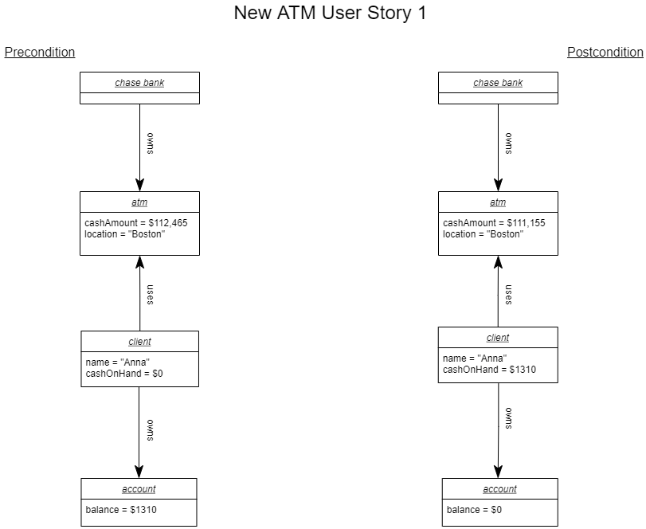
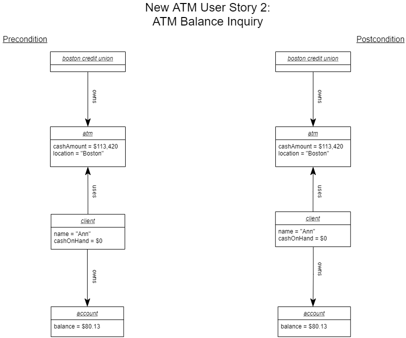

# Lab 2

Exercises from _Story Driven Modeling_ by Ulrich Norbisrath, Ruben Jubeh, Albert Zündorf

## 2.1.1  Mau Mau

Draw object diagrams for the start situation and for the situations after each
step of each user story built for the Mau Mau exercise in Section 1.6.2.1.

### Diagrams:

## 1.
### Initial

### Final

## 2.
### Initial

### Final

## 3.
### Initial

### Final

## 4.
### Initial

### Final

## 5.
### Initial

### Final

## 6.
### Initial

### Final

## 7.
### Initial

### Final

## 8.
### Initial

### Final

## 2.1.3 Mancala

Draw object diagrams for the start situation and for the situations after each
step of each user story built for the Mancala exercise in [Section 1.6.3.3](lab-challenges/lab01/README.md)

### Diagrams:
### 1 diagram

### 2 diagram

### 3 diagram

### 4 diagram

### 5 diagram

## 2.1.6 ATM Money Withdrawal

Draw object diagrams for the start situation and for the situations after
each step of each user story built for the ATM money withdrawal exercise
in Section 1.6.2.6

### Diagrams:

"Mistakes count positively!" p. 11 Lecture 1 slides.

"You need to truly excel and be pro-active to secure A." p. 11 Lecture 1 slides.

We were proactive for this particular lab to seek feedback and correct our mistakes.

#### New ATM object diagrams

