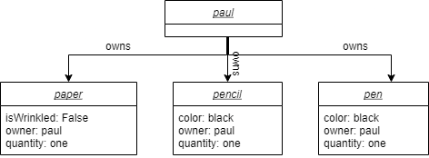
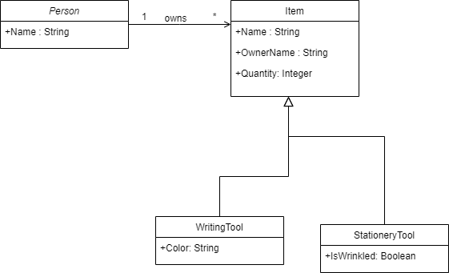
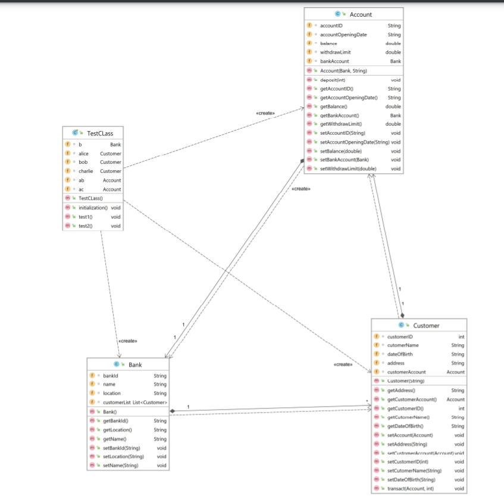
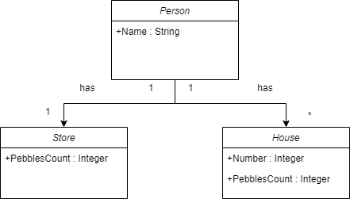
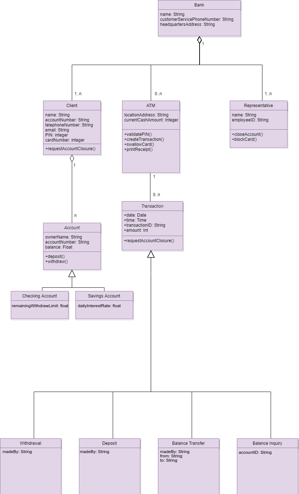

# Lab 3

## Table and Things
The following situation is given:
On a table there are a number of things: a pencil, a pen, and a sheet of paper. Both writing tools write in black color. The paper sheet is not wrinkled. All things belong to Paul.
Draw an object diagram modeling the above situation. Try to address all object properties, either by attributes or by links.
Derive a class diagram from your object diagram.
### Discovered curiosities:
- In comparison with Object Diagrams, in Class Diagrams there are many details to be considered such as Visibilty, Cardinality, Generalization and types of Relationships.
- Hierachical Relationship of classes makes the diagrams more structured and understandable.
### Diagrams:
#### Object Diagram

#### Class Diagram

#### Discussion
- Applying inheritance in this particular case allows us to avoid repition of attributes e.g. name of the item, owner's name and quantity of items.
- Thanks to inheritance, the structure of the diagram stays simple and understandable.

## Derive Classes from Code

The code for this diagram is [here](resources/SMLab03)

## Mancala
Derive a class diagram from the objects diagrams created in [exercise 2.1.3](lab-challenges/lab02/README.md)
#### Class Diagrams

#### Explanation of cardinalities
- One person in this game can have only one store.
- One person can have several houses (according to the rules of this game - 6 houses).
- One store belong only to one person.
- A House can belong only to one person.
#### Discussion
- There is one little drawback regarding classes Store and House which is the same attribute 'PebblesCount'. 
- Although repitition is not a good practice in this kind of diagrams, we decided to not generalize Store and House classes.

## ATM Money Withdrawal

1. ATM Class Diagram:

2. Explain the cardinalities chosen:
- Bank-Client: One bank has one or more clients (no bank has no clients).
- Bank-ATM: One bank has zero or more ATMs (not all banks have an ATM).
- Bank-Representative: One bank has one or more representatives (no bank has no human representatives).
- Client-Account: One client has one or more accounts (a client with no accounts is not a client).
- ATM-Transaction: One ATM has zero or more accounts (an ATM does not necessarily have any transactions, but may have n transactions as well).

3. Manually implement this class diagrams in Java (in for example IntelliJ) take special care to achieve bidirectional references and referential integrity (like shown in the lecture). Implement fluent-style access methods for all attributes.

    See [here](resources/ATMMoneyWithdrawal)

4. Create two tests, creating the two respective different object structures taken from two different object diagrams from exercise 2.1.6 Assign meaningful object names. Take one screenshot each of the fully expanded object-structure (in the debugger) at the end of the tests.

    See [here](resources/ATMMoneyWithdrawal)

5. Extend one of your tests with commands and a respective assert statement to prove that you implemented referential integrity for one to-n-association of your choice correctly. Explain why your test proves this.

    See [here](resources/ATMMoneyWithdrawal)

6.  Check in your class src files as well as Tests into your repository with a small readme how to add these to an IntelliJ (or other IDE you chose) project and run the tests.

    See [here](resources/ATMMoneyWithdrawal)
