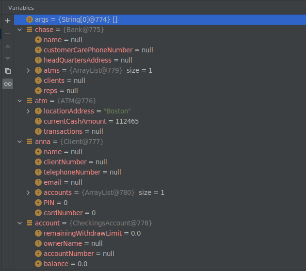
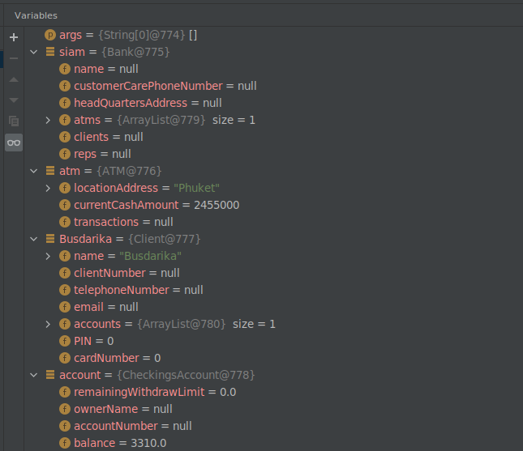

# ATM Money Withdrawal

This folder contains the necessary Java content for the task titled **ATM Money Withdrawal** of lab03.

Under the `src` folder, you will find the necessary `.java` files. Under the `tests` folder, you will find the class codes for the Test class. 

In order to run these codes, you will need JUnit. With IntelliJ IDEA you can simply use the `Alt + Enter` shortcut on either the 
    
    import org.junit.Assert;
or
    
    import org.junit.Test;

lines. Popup has all the necessary info.

Just import these files into a project you will create in IntelliJ IDEA and right click on the tests folder. Mark it as the Test Root Directory and right click on it again to run all tests.

Also please check the following screenshots of our debugging sessions:

## Test 1

## Test 2
