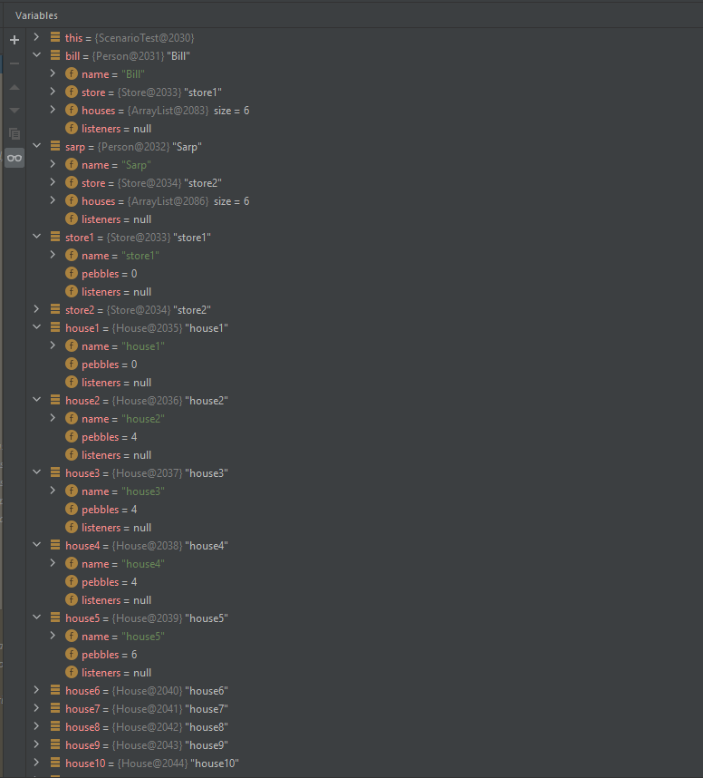

# **Lab 4**

# 1. Mancala Code Generation

### Class Diagram for Mancala (fulib)
#### re-implemented diagram from [lab 3](/lab-challenges/lab03/README.md)

### Object transition
Taken from the [scenario in the 1st lab](lab-challenges/lab01/README.md)
#### Initial state

#### 

- the beginning of the game. Bill starts the game and play against Sarp.
- Sarp anticipates the moment Bill finishes.
#### Current state

#### 

- Bill distributed pebbles into his 2nd, 3rd, 4th houses. Now 1st one is empty.
#### Auto-generated code [here](code/Mancala)
### Derived Class Diagram from objects in [exercise 2.1.3.](/lab-challenges/lab02/README.md)
#### Class Diagram

#### Explanation of cardinalities
- One store belong only to one person.
- A House can belong only to one person.
- One person in this game can have only one store
- One person can have several houses (according to the rules of this game - 6 houses)
#### Discussion
- There is one little drawback regarding classes Store and House which is the same attribute 'PebblesCount'. 
- Although repitition is not a good practice in this kind of diagrams, we decided to not generalize Store and House classes.

# 2. ATM Money Withdrawal Code Generation

- Re-implement your class diagram from lab session 3 in umple.

- Compare the generated code with fulib.

The code is located [here](code/JavaFromUmple).

- Say what is better or worse and why.

Fulib generates much simpler code with many fewer lines of code. Umple is much, much more verbose. In the case of the ATM withdrawal case, Umple generated nearly 1800 lines, whereas with Fulib only generated around 20 lines for the Mancala case. For the ATM Withdrawal case in Visual Paradigm, it only generated around 127 lines. So Umple is 10-20 times more verbose.

# 3. More Code Generation

We have decided to go with Visual Paradigm since it has a lot of documentations that can flatten the learning curve.

We redesigned both Mancala and ATM Class diagrams to see the effectiveness of the tool on different scales since these two diagrams are differ significantly in scale.

The Java code generated by the tool is, for the most part, useful as a template but we find it hard to conclude that it is production-ready. 
#### 
**The code is located** [**here**](code/ATM)
1. Is bidirectional referential integrity supported?

The tool allows the user to create relationships between classes and use cardinality and various relational reference types to explain the kind of relationships these entities have with each other. However, during code generation, these relationships are ignored. In order to create a code with, for example, aggregation, the user must specify the type of the attribute in the class. The tool automatically detects and allows the user to use as type of attributes the classes they created in the diagram.

2. How are attributes handled/implemented? How are getters and setters handled?

User can insert the name and type of the attributes in the classes and switch between them using the `Enter` button quickly. It supports different visibility types, initial value, multiplicity, scope, types (including the ones user have created in the diagram) and many other features. User can either choose the `Add Attribute with getters/setters` option, or decide to add these methods after creating the attributes using the details.

3. Is inheritance implemented correctly?

It is. Using the visual drag-and-drop tool to create a generalization relationship between classes, when done properly, results in the classes having child/parent relationship in the generated code.

4. How are associations implemented? How are cardinalities (to one and to many) implemented, are they implemented at all?

The associations created with the drag-and-drop tool provide an easy UI to show cardinalities, however it is ignored when generating Java code. It is required to go to the details of the class attributes and set the cardinalities for each of the associations. However, even then, it is a binary situation where a relationship is either defined as a singlular variable (i.e. `Account account`) or simply a collection (i.e. `Collection<Account> accounts`). The real boundaries such as  `1..6` are ignored.  

5. What convenience methods are generated? Is fluent style supported?

Typical getters/setters. If one specifically makes the methods in a fluent-style way, then it can be done but there is no out-of-the-box support for that as far as we can see.

# 4. Code Generation Discussion

(You have now seen three modelers with code generation in practice and also created code for your classes manually - 4th option)
(every team member understands code generators and outputs)
### Advantages & Disadvantages
(lead a discussion about the advantages & disadvantages of each of the tools and their created code)

#### fulib

    Advantage: It has extensive output: class diagram, object diagrams, generated java test code. We can also download the output archive and run, test and debug in IDE.

    Disadvantage: There is only one option to model which is to write a scenario that demands particular syntax.

#### Umple

    Advantage: Provides a lot of extra code in case the developer needs it.

    Disdvantage: The auto-generated code is much more verbose than necessary. And the drag-and-drop interface is somewhat slow and unresponsive.

#### draw.io

    Advantage: draw.io is very accessible and easy to use for a novice modeler. 

    Disadvantage: It does not generate any code whatsoever as it is completely graphical.

#### Lucid Chart

    Advantage: Lucid chart is easy use. Many users can collaborate at once. It integrates with  famous management tools like Jira & Confluence etc.  
    
    Disdvantage: It does not help to generate code for diagrams drawn. Also it does not have a desktop app. 

### Ranking criteria (scale 0 - 10)
#### Convenience
- Fulib: 7
- Umple: 3
- draw.io: 4
- Lucid Chart: 7
#### Ease of use
- Fulib: 7
- Umple: 3
- draw.io: 8
- Lucid Chart:9
#### Speed
- Fulib: 4
- Umple: 3
- draw.io: 3
- Lucid Chart: 8
#### Usefulness of auto-generated code
- Fulib: 7
- Umple: 2
- draw.io: N/A
- Lucid Chart: N/A
### Ranking Modelling methods
(while discussion, rank all four tools/methods regarding your criteria on a scale from 0 to 4 )
#### Fulib: 2
#### Umple: 1
#### draw.io: 1
#### Lucid Chart: 4
### Discussion Notes
- we agreed that fulib is good in terms of output although it takes a lot of time
- draw.io is quick to create a diagram but it is manual which takes a lot of time
- umple is the worst option in our opinion as it has confusing structure

# 5. Mancala Use Case Diagrams

Design two use case diagrams for your Mancala design, one very high level only showing the players interacting with the system and only the immediate use cases they are interacting with.

- As the second use case diagram, design a very detailed use case diagram that also takes into account the web-login and the option to run several games at once on your Mancala server.

- Discuss which of the two would be helpful for which part of the development of a web-based multiplayer mancala game and why. 

----The first use case diagram would be helpful in the start of the design phase to understand the basics regarding the game flow. 
Where as the second detailed use case diagram would be helpful later in the design phase as it would help to understand the interaction of user with multiple things like  how the server would start and how can a user play and select and play one game inside the game server. 

- Decide as a team if any of the two versions of diagrams would be helpful for you to design this web game or if you would rather use a component diagram (or yours from last time).

----This use case diagram will be helpful in understanding the basic flow and interaction of the user with the system. For detailed like what components are included inside the game server , component diagram would be needed at that point. 

# 6. Mancala Personas

(design two potential personas for Mancala (of two different player types) in detail that show that they impact or impacted specific design decisions for your Mancala system) 
- These can be decisions you already made - reference them to the respective story/design decision you make now based on their profile. 
- one person could be a normal player, the other could be twitch streamer (e.g. “cheater” who tries to break games)
### 1 Persona Diagram - Regular player

Reference scenarios:
[1 lab. 1.6.3.3 exercise. 1st user story](lab-challenges/lab01/README.md)

### 2 Persona Diagram - Cheater

Reference scenarios:
[1 lab. 1.6.3.3 exercise. 7th user story](lab-challenges/lab01/README.md)

# 7. ATM Money Withdrawal Use Case

1. 
1. 

The first one would be more beneficial during the earlier development stages where we are trying to get an general overview of the system. The latter would prove more helpful when actual implementation starts to take place. The reason is, initially we don't need very much details since the design can change but logic is more likely to stay the same. As for how that logic will be implemented, that is where more detail will be needed.

It would be useful for us as is. Depending on the scale of projects, alternative artifacts might be considered but for goals and purposes of the ATM software, this would be enough for us.

# 8. ATM Money Withdrawal Personas

- Design two potential personas for your ATM Money Withdrawal system in detail.
- Pick two personas representing customers that withdraw money.
1. completely normal person. 

2. who has a lot of debt and always tries to overdraw their account (consider either motivating a protection for the latter person or an easy credit system with recurring payments to pay the money back). 

- Discuss the relation of these personas in contrast with the persons you defined in your stories and vote on which artefact supports your software development more (as well as note down the main point why you think so).

We all voted that the four use cases (deposit, withdrawal, balance inquiry and ATM card being swallowed by the ATM) are more useful in terms of developing the ATM software.
