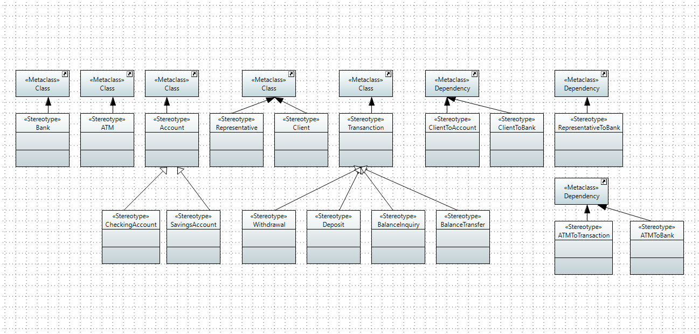
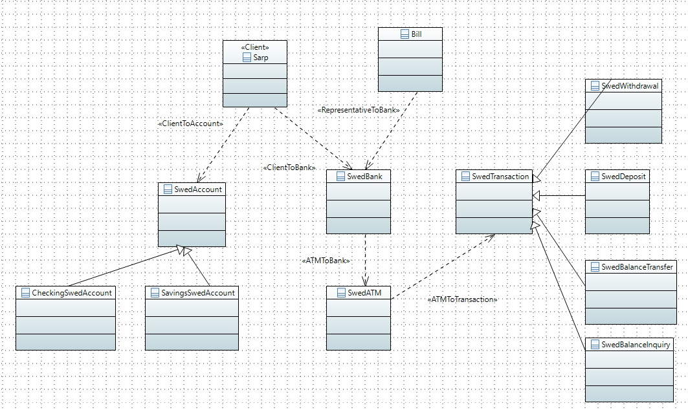

# **Lab 5**

### ATM Money Withdrawal
#### UML profile

#### Model

- Comment: all classes have properties, but not displayed. In order to see all properties, download the [project](/resources/project/) and open it in Esclipse IDE.

#### Description:
- IDE: Eclipse
- Tool: Papyrus
- Mostly based on the [class diagram from lab 4 - task 2](/lab-challenges/lab04/README.md)
- This model is applicable with [examples and scenarios](/lab-challenges/lab01/README.md)

