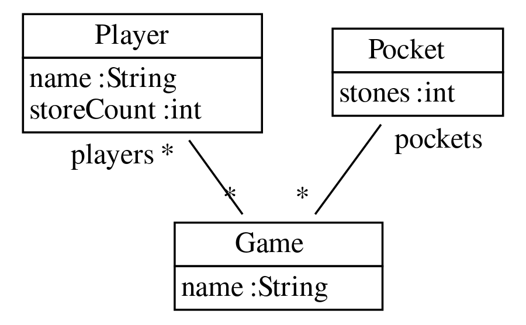

# Lab 6

## Mancala Controller and Tests

Improvements are made to the class diagram through fulib as can be seen:

You can find the tests in [the test file](task1Codes/src/test/java/MancalaTest.java) inside the project.

- First test creates an instance to test the pebble stealing through API and then, again, runs the scenario through API calls. 

- Second test checks if player gets to play again after landing the last pebble in his/her own store.

- Third test uses two threads that waits each other to simulate two players playing a full round. The first thread's time to make a move is randomly generated so the second thread actually responds, and does not simply wait a hard-coded amount of time.

## Component Diagram Mancala Network Game

#### 
Create two component diagrams:
- High level view stressing the network connectivity and app running on a phone.

- Detail view of just the server part of the game.

### Discussion:
- **Conclusion**: No, a component diagram cannot completely replace a requirements analysis document because a component diagram is missing use cases, user personas, functional and non-functional requirements, among other things. However, it is a worthwhile addition since it shows how different components in a system interact with one another (including whether a component is required or provided). Component diagrams would help to clarify the architecture and have a general idea about the functionality of the system.

## Component Diagrams ATM Money Withdrawal

Here we will also go a little bit beyond what you have designed until this point.
Create two component diagrams:

- High level overview of the ATM software embedded in its relevant bank ecosystem (for example account management, transaction log, software updater, monitoring, and maintenance running in a secure cloud environment of the bank operating the ATM).

- Detailed overview of the software running on the ATM also operating the hardware of the actual cash dispenser and card reader.

### Discussion:
- **Conclusion**: No, a component diagram cannot completely replace a requirements analysis document because a component diagram is missing use cases, user personas, functional and non-functional requirements, among other things. However, it is a worthwhile addition since it shows how different components in a system interact with one another (including whether a component is required or provided).
