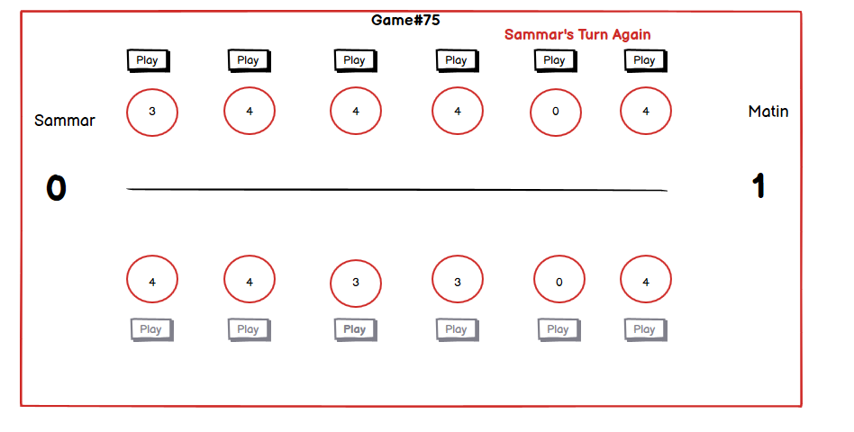

# Lab 7

## Mancala Sequence Diagrams

#### 1. Waiting for your turn.

#### 2. Game lobby - start game when two players are ready to play

Show the interaction of three players (two active and one inactive player) and the game server (you can ignore the GUIs here) in the game lobby until a game for the two active players starts. It needs to be visible in the sequence diagram that all the players connect to the server and the way they agree who is playing a game with whom as well as the assignment of a game board (or board ID) from the server to them.

## Mancala Wireframes

Take one or integrate and augment several of your scenarios into one big scenario covering all parts of the game (just show 3-4 turns and skip the others). The scenario should cover:
- the connection to the server
- the time in the lobby
- start of the game
- some actual gameplay
- winning (or losing) the game

Augment all these parts with Wireframes showing a potential snapshot of the GUI (these need to be different from the next task and be more prototypic). You can use paper drawings for this or a tool like balsamiq or Plant UML - use standard UI elements with text in them. Please don’t use real graphics for the Pits and Pebbles - keep it simple.

## Mancala GUI

Code for the improved API server [is here](MancalaCode/MancalaServer).

Code for the GUI, using Java Swing libraries, [is here](MancalaCode/MancalaClient).

Screenshots:

- GUI instance to create a game.

- Joining one of the available games.

- Game about to start.

- Play buttons being grayed out when it is opponent's turn.

