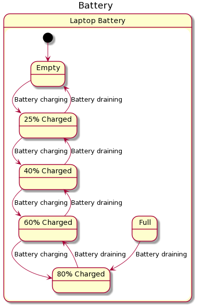

# Lab 9

## Statechart and Model Checking

1. Design a statechart for power management and battery conditioning of older laptops with an external power switch like the case discussed and presented in class.

As interaction with the statechart, use a 
- “forward 10 minutes”
- “set laptop active”
- “set laptop inactive”
- “turn on”

Only simulate five states of the battery: 
- empty
- 25% charged
- 40% charged
- 60% charged
- 80% charged
- full

Assume that the battery moves from state to another every 30 minutes (either charging or discharging depending on state of the power switch).

Code is located [here](sismic-code). 

2. Implement the statechart in Sismic, Umple, or Xstate. (If you want, you can also fulfill task 1 with this as Sismic can generate PlantUML code).

Implement a small test starting with an empty charge sending different actions (about 20 steps reasonably different steps) to it and assert that it never reaches more than 80% charged (never full).
