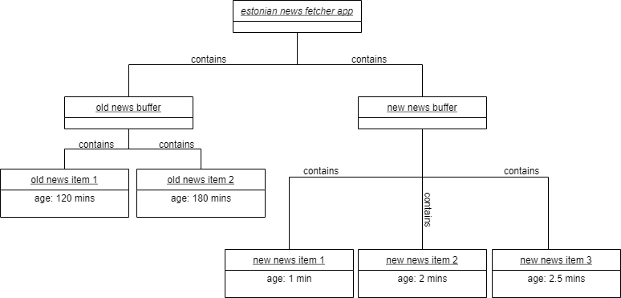

Bill Sendewicz

September 14, 2021

Definition of software architecture: Martin Fowler's idea of shared understanding. I agree with this component of the definition (and incidentally, I was one of the ones who shared this particular definition :) ), and I think it's important because software engineering is a team and cultural discipline. And the shared understanding component forms a backbone or a unifying element to move everyone on the team forward toward the 

And later, p. 8 of the slides reinforces this conception: "it's about communication about people."

I agree with the idea that architecture diagrams are useful for testing as well, in a similar way that architecture diagrams bring an cohesive, overall structure to the codebase and the 

a diagram/picture can convey more information more quickly than text

"Code is the single point of truth." I largely agree, but I think it would be better stated to say that the code is an instantiation of the architecture (and its diagrams). Imagine there are 10 or 100 development teams all working from the same architecture diagram. I think all 10 or 100 codebases will be similar, but not identical. And arguments can be made for why one is superior to another. So I would argue that the architecture is more like a class or a Docker image and the code is an instantiation, like an object or a Docker container.

Software Architectures/System Models--why do we need them (even for test driven development)?

– Because they quickly and easily convey the system we're trying to build, code, use and sell in a very short amount of time. And they help to keep all stakeholders on the same page regarding the system.

#### Find two pro arguments and two contra arguments for object diagrams:

Optional: relate to personal situations (could have helped or would have made things harder):

Two best points in favor of Class Diagrams:

1. Very clear and easy to grasp.

2. Keep all stakeholders of the system on the same page.

Two best points against Class Diagrams:

1. They only cover one tiny aspect of large systems.

2. No dynamic quality to them.

