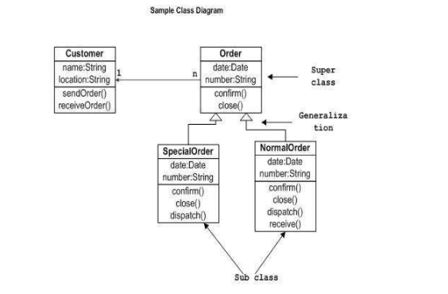
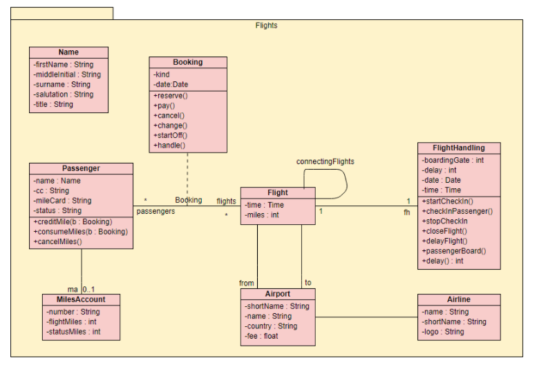

Bill Sendewicz

September 21, 2021

Pre-lecture HW:

Two arguments for class diagrams:

1. They capture the class nature of a system really well, including inheritance and cardinality.

2. They're fairly easy to grasp, especially if one is familiar with object-oriented programming.

Two arguments against class diagrams:

1. They don't capture any dynamic features of the system.

2. They only capture one small aspect of the system, namely, the classes in a system.

Two examples of class diagrams (one you like, and one you dislike) and state why.

1. I like the following diagram because it's very clear and easy to understand for noobs like me.

2. I dislike the following diagram because the Name class is not connected to any of the other classes. It's just hanging out all by itself. Is it correct that it's disconnected from the rest of the other classes?

### In-class Discussion

Notes for Group Number 1

Moderator: Daichi Ando

Note-Taker: Bill Sendewicz

Third person: Matin Manafov

#### Opening Notes

We talked through the roles and assigned roles to each person. We briefly introduced ourselves.

#### First Person Pro Notes

Class diagrams capture inheritance

Can have a hierarchical structure, which makes the diagram more succinct, removes repetition.

#### Second Person Con Notes

Using class diagrams takes more time to draw than object diagram

Rigid structure: an object diagram is easier to write. Just write the object name and any attributes you want to include below the name. However, for a class diagram, there are more rules to follow.

#### Third Person Pro Notes

Class diagrams allow for multiplicity: we can easily see the cardinality of relations (1:1, 1:n, n:1, n:n)

We can also specify the visibility of the class (public, private, protected)

#### Fourth Person Con Notes

They’re harder to interpret than object diagrams; many more factors to consider than object diagrams. For example, class diagrams capture visibility, multiplicity, cardinality, and generalization.

#### Moderator Summary Notes

Besides the fact that class diagrams have more complexity than object diagrams, it was harder to find cons for class diagrams.

#### Round 1 Person Challenge/Question Notes

Why is it a bad thing that class diagrams are more complex than object diagrams?

#### Round 1 Person Comment/Defense/Answer Notes

Object diagrams are too simplistic. They don’t capture relationships or any changes over time.

#### Round 2 Person Challenge/Question Notes

What is the biggest difference between an Object diagram and a Class diagram?

#### Round 2 Person Comment/Defense/Answer Notes

The Class diagram is more abstract than Object Diagrams that is why, for example, attributes do not have values, some classes can be generalized, etc. 

#### Round 3 Person Challenge/Question Notes

The class diagram looks like a relational database, what is the difference? 

#### Round 3 Person Comment/Defense/Answer Notes

The difference is that a relational database has actual tables, which contain data/values, related to each other. In Class Diagrams, classes are like cliches for the instances. A certain number of instances(objects) are created according to a particular class.

#### 2 Best For

- Point 1: Class diagrams capture inheritance

- Point 2: Can have a hierarchical structure, which makes the diagram more succinct, removes repetition.

#### 2 Best Against

- Point 1: Using class diagrams takes more time to draw than object diagram

- Point 2: They’re harder to interpret than object diagrams; many more factors to consider than object diagrams. For example, class diagrams capture visibility, multiplicity, cardinality and generalization.
