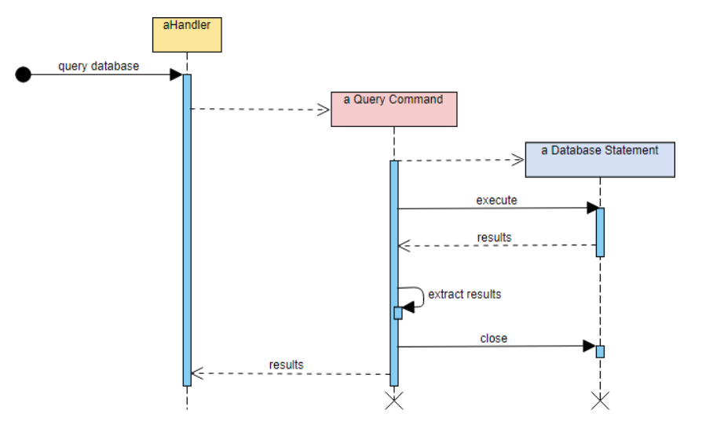
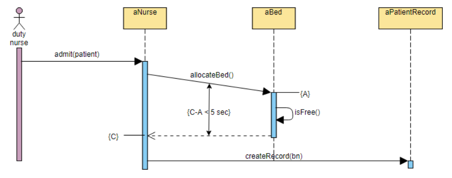

Bill Sendewicz

October 19, 2021

### Pre-lecture HW:

For sequence diagrams:

Two pros, two cons and two examples: one that you like, one that you dislike--with reasons why.

#### Sequence Diagrams:

Pros:

1. It shows the changes to objects in the system over time, i.e., it's one of the few diagrams that's dynamic.

2. Very easy to understand the flow of events and minor details are abstracted away.

Cons:

1. Key details in a system can be lost because details are abstracted away.

2. May be hard to maintain over time especially for complex and highly-evolving systems.

Examples: 

1. I like the following diagram because it's simple and easy to grasp within a second or two.

2. I dislike the following diagram because it's less clear than its counterpart and raises almost as many questions as it answers in my mind.

### Notes for Group Breakout Session

Notes for Group Number 1

Moderator: Daichi Ando

Note-Taker: Joanna Mae Cabuyadao

#### Opening Notes

Moderator welcomed everyone in the discussion. He presented an invitation to talk about the pros
and cons of sequence diagrams.

#### First Person Pro Notes

Daichi: When you write the sequence diagram, you have the events and processes. Each
process is a message similar to a method and each event is an object. It becomes easier for
developers to write the code.

#### Second Person Con Notes

Bill: Sequence diagrams are not useful for simple logic.

#### Third Person Pro Notes

Daichi: It’s easy to see the lifetime of an object given the sequence diagrams. Compared to other
diagrams, we can also see the order of processes and events.

#### Fourth Person Con Notes

Bill: Like all other diagrams, it can become obsolete very quickly, especially if diagrams are
overly complex.

#### Moderator Summary Notes

Daichi: Sequence diagrams show the interactions between objects arranged in time sequence.

#### Round 1 Person Challenge/Question Notes

Bill: Interpretations by developers could be different in actual implementations in code.

#### Round 1 Person Comment/Defense/Answer Notes

Daichi (and Joanna inserting herself): Everyone should agree on the standards beforehand.

#### Round 2 Person Challenge/Question Notes

Daichi: If sequence diagrams are for complex systems, it is gonna be massive to articulate all
the events and processes happening.

#### Round 2 Person Comment/Defense/Answer Notes

Joanna: Then sequence diagrams therefore, are best for not so simple, but also not so complex
systems.

#### Round 3 Person Challenge/Question Notes

Bill: Sequence diagrams are the best diagrams.

#### Round 3 Person Comment/Defense/Answer Notes

Daichi: I agree because they are dynamic (vs static component diagrams).

#### Free discussion to find best points for and against

2 Best For
- Point 1: Dynamic - shows order of objects and events (vs component diagrams, etc)
- Point 2: Descriptive - shows lifetime of objects and events

2 Best Against
- Point 1: Can become obsolete quickly for complex systems
- Point 2: Can become too irrelevant for simple logic but too massive for complex systems

