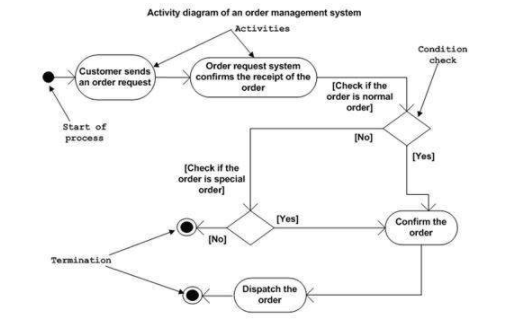

Bill Sendewicz

November 2, 2021

Note: I assisted Ulno with the event storming demonstration in class today.

### Pre-lecture HW:

Two arguments for activity diagrams:

1. They capture the dynamic elements of the system.

2. These are the diagrams I've been waiting all semester for! I think activity diagrams are the most important diagram because they capture the meat and potatoes of the system. Most of the other diagrams captured varying degrees of tangential aspects of a system, but this captures the heart of the system in a relatively succinct and compact diagram, even for more complex systems.

3. Can be used in other software development paradigms beyond just OOP.

4. They allow for parallel behavior among a system's components, and thus, they can model multithreaded processes.

5. They capture state and they articulate how a particular component or activity accomplishes a task, not just the "what" of the component.

Two arguments against activity diagrams:

1. They do not correspond to the code one-to-one.

2. Some key details _can_ be omitted, such as the messages between components in the system.

Two examples of activity diagrams (one you like, and one you dislike) and state why.

1. I like the following activity diagram because it's super clear and easy to understand the flow of events through the system.

2. There are no activity diagrams I don't like. I love them all. They're so clear and informative, even for complex systems. I love all the diagrams on this tutorial page: https://online.visual-paradigm.com/diagrams/tutorials/activity-diagram-tutorial/

### Notes for Group Breakout Session

Notes for Group Number 1

Moderator: Adil Abdurrazakli

Note-Taker: Daichi Ando

Members: Bill, Joanna, Kamil Aliyev, Matin Manafov

#### Opening Notes

Bill said, “I love this diagram!”. 

#### First Person Pro Notes

They look like a flow chart, so it seems to be applicable for a wide range of stakeholders 

#### Second Person Con Notes 

There is not much detail in the flow chart, so it’s not gonna be helpful for developers. 

#### Third Person Pro Notes

They allow for parallel behaviour among a system's components, and thus, they can model multithreaded processes.

#### Fourth Person Con Notes

If the system is big, the diagram is also massive so it is hard to picture out. 

#### Moderator Summary Notes

The warm, positive feelings toward activity diagrams today were off the charts.

#### Round 1 Person Challenge/Question Notes

For the statement of “not useful for developers”, Bill said, “Are You Serious?!”

Bill thinks it is still quite beneficial for developers. 

#### Round 1 Person Comment/Defense/Answer Notes

While it may give a general idea about the flow of the program, and is useful for non-technical people, it leaves out significant details--classes, objects, methods--of the program. It just shows the actions of the system.

#### Round 2 Person Challenge/Question Notes

There are a bunch of other diagrams, why would we need this one to show to non-engineers like business people?

#### Round 2 Person Comment/Defense/Answer Notes

It is especially good for non-tech people. Even for users, it is useful. 

#### Round 3 Person Challenge/Question Notes

In terms of development point of view, what diagram is more useful than an activity diagram?

#### Round 3 Person Comment/Defense/Answer Notes

The class diagram shows the implementation in detail, and it is very clear. 
We can use many diagrams simultaneously: class diagrams give us the object and class structure and will help decide which class will be used in which process; activity diagrams; and sequence diagrams if we need them.

#### Free discussion to find best points for and against

They capture the dynamic elements of the system.

These are the diagrams I've been waiting all semester for! I think activity diagrams are the most important diagram because they capture the meat and potatoes of the system. Most of the other diagrams captured varying degrees of tangential aspects of a system, but this captures the heart of the system in a relatively succinct and compact diagram, even for more complex systems.

Can be used in other software development paradigms beyond just OOP.

They capture the state and they articulate how a particular component or activity accomplishes a task, not just the "what" of the component.

#### 2 Best For

Point 1: It is especially good for non-tech people. Even for users, it is useful.

Point 2: These are the diagrams I've been waiting all semester for! I think activity diagrams are the most important diagram because they capture the meat and potatoes of the system. Most of the other diagrams captured varying degrees of tangential aspects of a system, but this captures the heart of the system in a relatively succinct and compact diagram, even for more complex systems.

#### 2 Best Against

Point 1: While it may give a general idea about the flow of the program, and is useful for non-technical people, it leaves out significant details--classes, objects, methods--of the program. It just shows the actions of the system.

Point 2: If the system is big, the diagram is also massive so it is hard to picture out.
